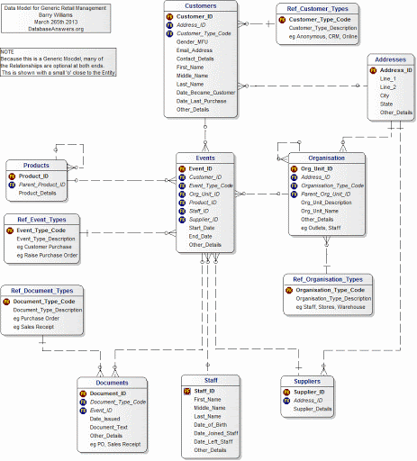
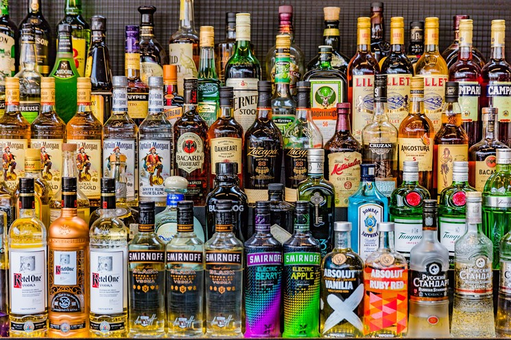
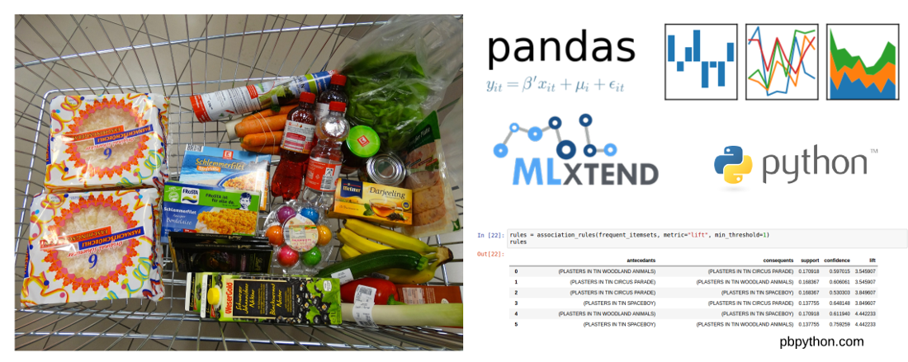
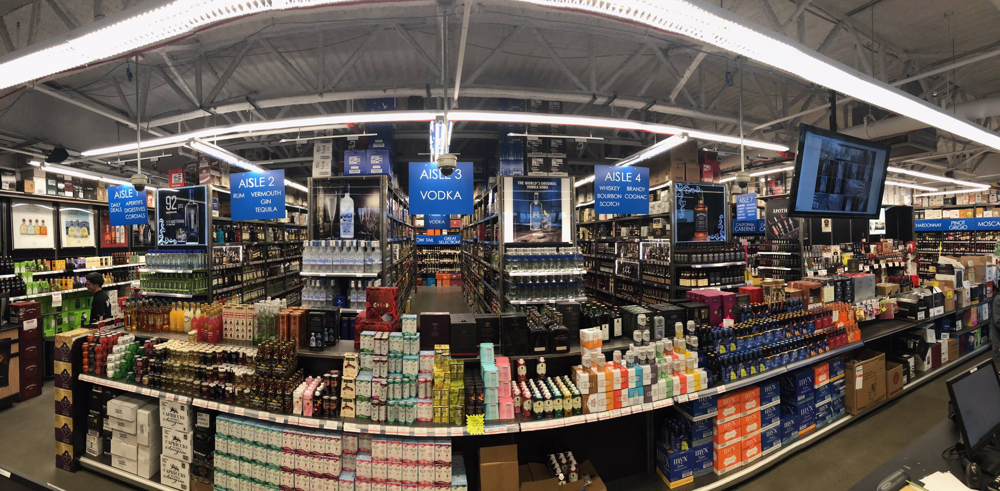

# Iowa Liquor Sales Analysis

Using Google Big Query, dataset provided by Iowa state containing the spirits purchase information of Iowa Class "E" liquor licenses by product and
data of purchase from January 01, 2012 to the current date was used to produce actionable insights for business investors.The dataset can be used to
analyze total spirits sales in Iowa of individual products at the store level. Using MBA (Market Basket Analysis), time series (ARIMA, SARIMA) for
for seasonality trends, and various other ML models, the aim of this project is to equip investors with the proper informaion/tools for quick
business analysis and application to improve ROI and increase profit margins.

Additional dataset about vendors, containing over 10K observations/information, was also used to get a complete overview of the entire liquor marketplace.

